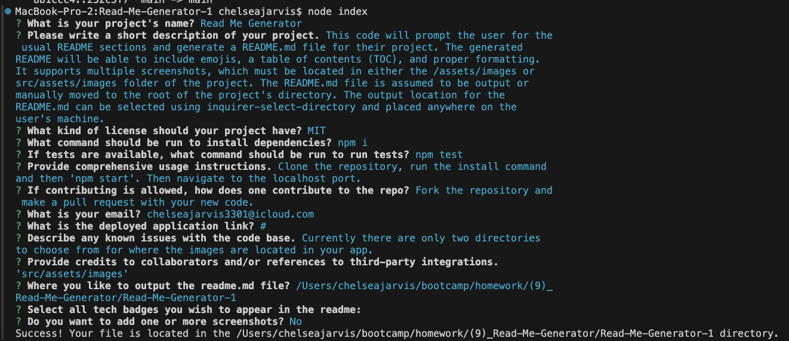

# Read Me Generator 
   
  
  ## Description  ✏️
  
  This code will prompt the user for the usual README sections and generate a README.md file for their project. The generated README will be able to include emojis, a table of contents (TOC), and proper formatting. It supports multiple screenshots, which must be located in either the /assets/images or src/assets/images folder of the project. The README.md file is assumed to be output or manually moved to the root of the project's directory. The output location for the README.md can be selected using inquirer-select-directory and placed anywhere on the user's machine.
  
  ## Table of Contents 📖
  
  [Installation](#installation)

  [Usage](#usage)

  [License](#license)


  [Issues](#known-issues)

  [Contributing](#how-to-contribute)

  [Tests](#tests) 

  [Credits](#credits)

  [Questions](#questions)
  
  ## Installation 
  
  To install necessary dependencies, run the following command:
  
  ```
  npm i
  ```
  
  ## Usage 
  
  Clone the repository, run the install command and then 'npm start'. Then navigate to the localhost port.

  ### Deployed Link
  #

### Screenshots



______________________________________________________________________________________

## License
This project is licensed under the MIT license.

## Known Issues 
Currently there are only two directories to choose from for where the images are located in your app.

## How To Contribute 
  
Fork the repository and make a pull request with your new code.
  
## Tests 
  
To run tests, run the following command:
  
  ```
  npm test
  ```


## Credits 

This project uses two npm packages:

[inquirer](https://www.npmjs.com/package/inquirer)

[inquirer-select-directory](https://classic.yarnpkg.com/en/package/inquirer-select-directory)

 ## Questions 
  
 If you have any questions about the repo or notice any bugs you want to report, open an issue or contact me directly at chelseajarvis3301@icloud.com. 
  
  